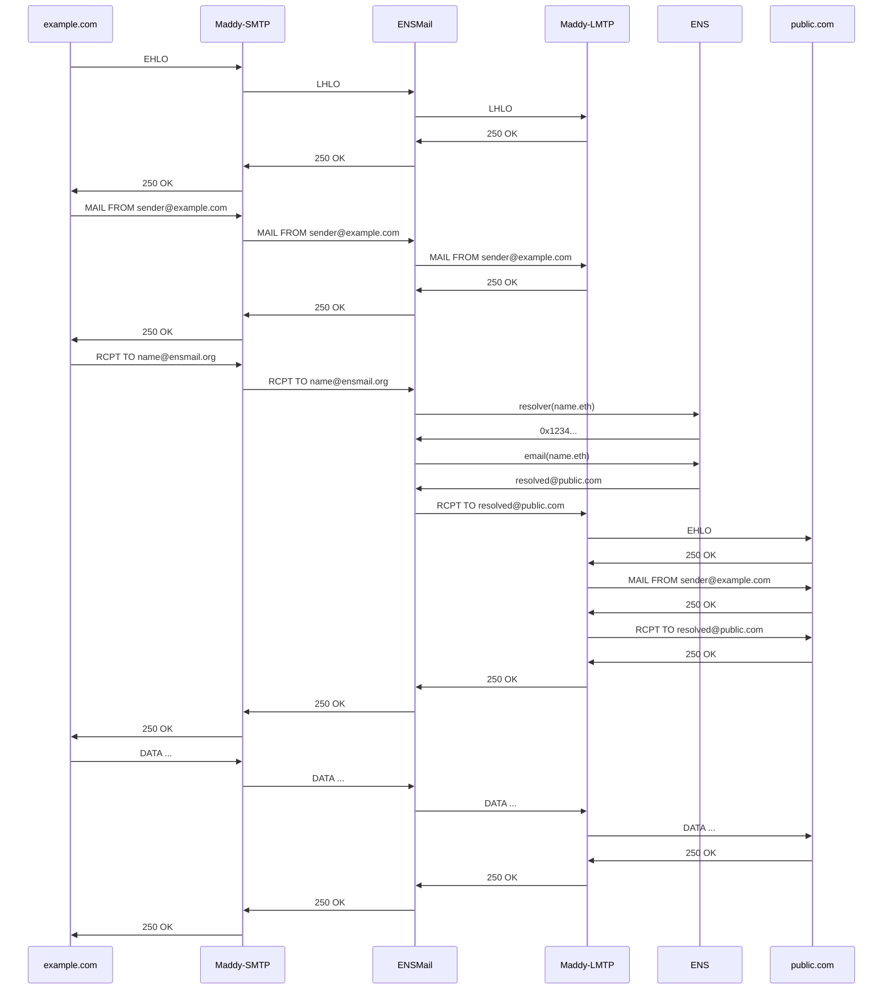

# 🅴🅽🆂mail 📨

ENSMail is an email forwarding service for the [Ethereum Name System](ens.domains).

##### 1. Send mail to `<ANY_ENS_DOMAIN>@ensmail.org`

##### 2. ENSMail.org forwards the mail to the [ENSIP-5 Text/Email Record](https://docs.ens.domains/ens-improvement-proposals/ensip-5-text-records) for `<ANY_ENS_DOMAIN>.eth`

[Try it out!](mailto:<any_ENS_domain>@ensmail.org?subject=Hello%20ENS%20User)

## Technical Details

The ENSMail system is comprised of 2 components: the [Maddy email server](maddy.email) and a custom built ENS email resolution service (ENS service).
- Maddy exposes a public SMTP endpoint (over STARTTLS, with dmarc, dkim, and spf mail verification).
- Maddy forwards incoming mail to the ENS service over LMTP.
- The ENS service looks up the mail's RCPT addresses in ENS, and queries the text/email record.
- ENS service rewrites the mails RCPT addresses with the addresses found in ENS, and forwards the mail over LMTP to Maddy
- Maddy receives the re-written mail and forwards it to the remote SMTP server (over STARTTLS, with dane and mta-sts server verification).

This diagram documents the SMTP/LMTP message flow for a successful mail forwarding session initiated by `sender@example.com`.

*Note: Unlike conventional SMTP servers which maintain an outgoing mail-queue and retry logic for failed deliveries, ENSMail uses connection-stage rejection.  If an incoming message can't be immediately forwarded to its ultimate destination, the message will be rejected.*

## Development

Development requires go1.17 or later.  Run `make test` to run unit tests, and `make build` to build.

Integration tests can be run with `make test-full`, but require the following binaries in $PATH:
1. [mkcert](https://github.com/FiloSottile/mkcert), to generate local TLS certificates.
2. [maddy.cover](https://github.com/foxcpp/maddy/blob/master/tests/build_cover.sh), debug-enabled `maddy` executable required by the maddy testing suite.

## Deployment

1. Generate production TLS certificates (with [Let's Encrypt](https://letsencrypt.org/), or otherwise), and set `TLS_CERT_FILE=<path to cert>` and `TLS_KEY_FILE=<path to key>` in [configs/maddy.env](configs/maddy.env).
2. Set `HTTP_WEB3_PROVIDER=<http endpoint>` in  [configs/web3.env](configs/web3.env).
3. Run `sudo make install` (this enables the `ensmail` service)
4. Start with `sudo systemctl start ensmail`

*Note: Additional system administration steps are required to run a production email system.  Please read the [maddy installation guide](https://maddy.email/tutorials/setting-up/) for further information.*
